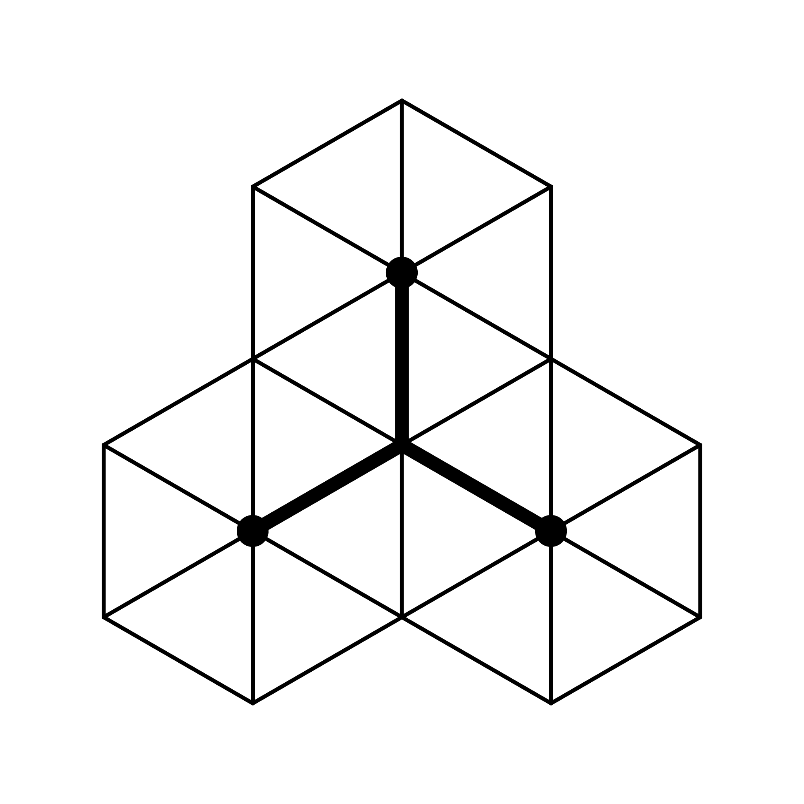

# Zlab.Discrete
<picture>
  <source media="(prefers-color-scheme: dark)" srcset="docs/icons/icon_dark_trans.png">
  <source media="(prefers-color-scheme: light)" srcset="docs/icons/icon_light_trans.png">
  
</picture>

A fully managed .NET library for voxelization, meshing, and distance field computation.

- [Documentation](https://sean1832.github.io/ZLab.Discrete/)

## Overview

**Zlab.Discrete** provides tools for constructing and processing voxel grids from 3D geometry. It is written entirely in C#, requires no external dependencies, and is designed for easy integration into .NET projects.

## Features

**Voxelization**
  - Anisotropic voxelization (non-uniform voxel sizes)
  - Dense occupancy grids
  - Sparse boundary voxelization

**Distance Fields**
  - Euclidean distance transform (exact, isotropic and anisotropic)
  - Signed distance field (SDF) generation
  - Sampling with nearest-neighbor or trilinear interpolation
  - Gradient computation from SDFs

**Meshing**
  - Face-culling voxel meshing

**Grid Processing**
  - BFS-based flood fill for interior/exterior classification

## Use Cases
- Preprocessing 3D meshes into voxel grids
- Generating SDFs for geometry processing, physics, or rendering
- Mesh extraction from voxel volumes
- Spatial analysis and computational geometry research

## Supported Frameworks
- .NET Framework 4.7.2
- .NET Framework 4.8
- .NET Standard 2.1
- .NET 7.0
- .NET 8.0
- .NET 9.0

## License
ZLab.Discrete is licensed under the PolyForm Noncommercial 1.0.0 license.

TL;DR — You may use, modify, and distribute ZLab.Discrete **for noncommercial purposes** 
(including personal projects, education, academic research, nonprofits, and government) 
subject to the PolyForm-NC terms. **Commercial use is not permitted**. 
For commercial licensing, contact dev@zekezhang.com.

See the [LICENSE](LICENSE.md) file for more details.